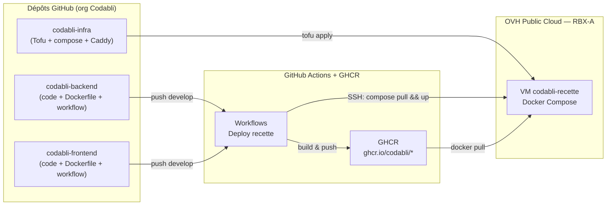
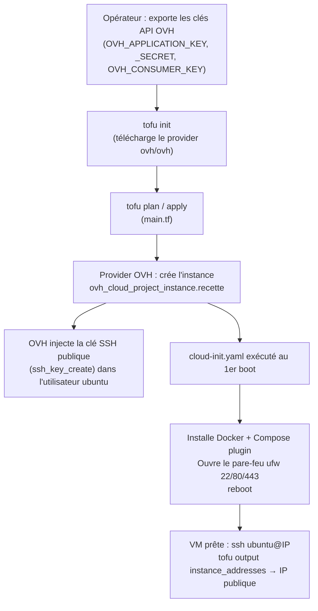
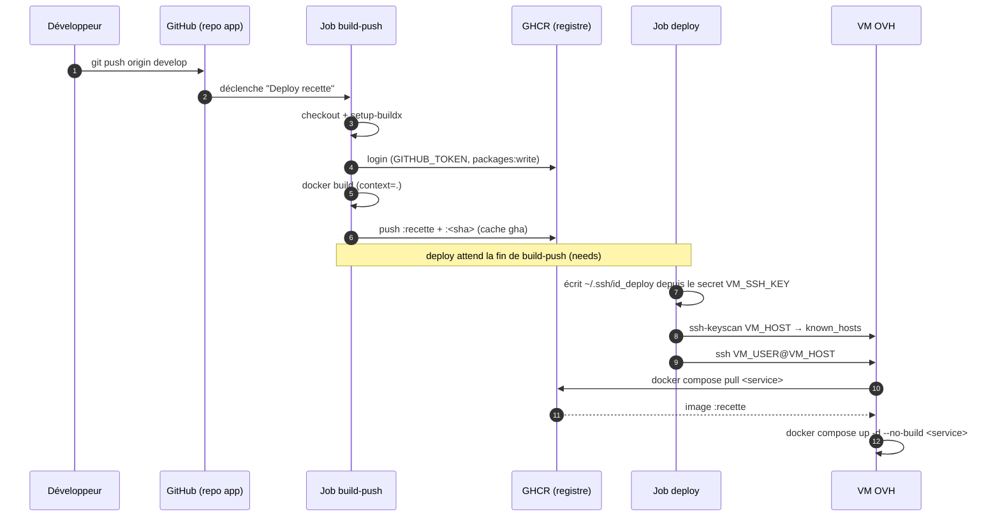
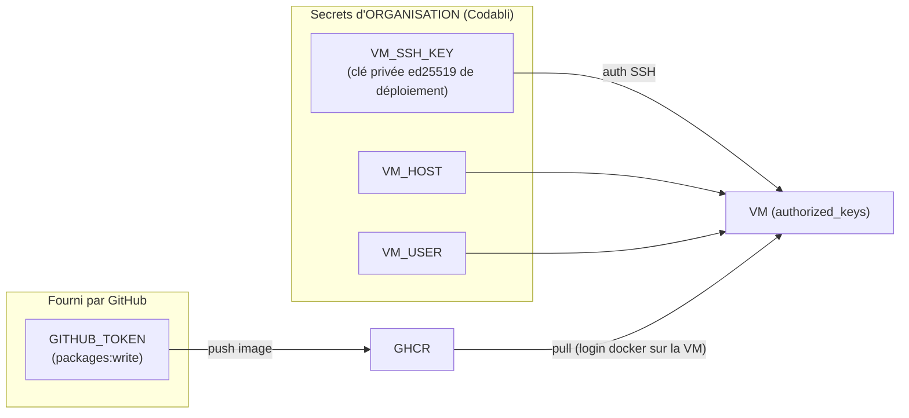
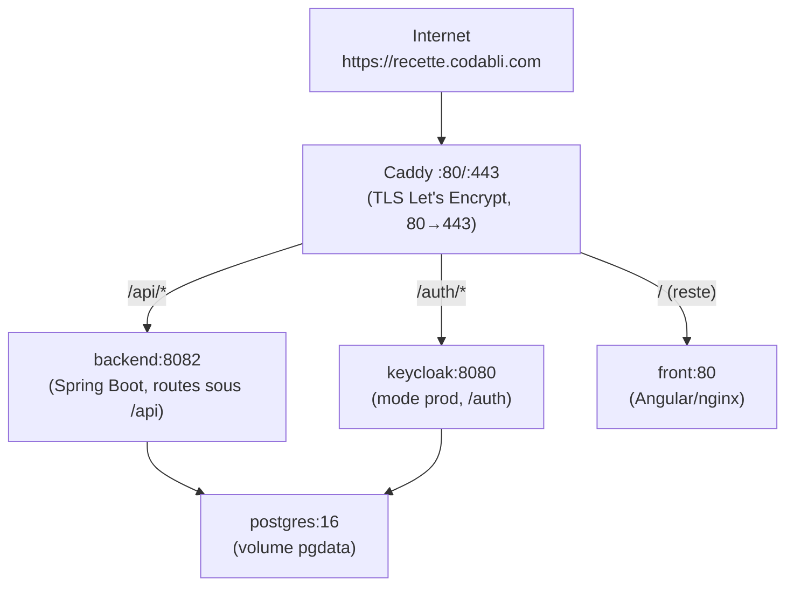

# Déploiement de la recette Codabli — de la VM à la CI/CD

> Comment l'environnement de recette est construit (serveur OVH via OpenTofu) et
> comment GitHub pousse automatiquement les images sur ce serveur.
>
> Environnement : `recette.codabli.com` (OVH Public Cloud, IP `51.178.223.90`).

**📚 Dans ce repo :** [README](../README.md) (prérequis OVH, lancer Tofu) ·
[TUTO_OPENTOFU](TUTO_OPENTOFU.md) (prise en main IaC) ·
**DEPLOIEMENT_RECETTE** (ce fichier).

---

## 1. Vue d'ensemble

Trois dépôts Git coopèrent, GitHub orchestre, OVH héberge :



Deux mécanismes distincts, à ne pas confondre :

| Mécanisme | Outil | Rôle | Fréquence |
|---|---|---|---|
| **Provisionnement** | OpenTofu (`codabli-infra`) | Créer/détruire la VM et son OS | Rare (one-shot) |
| **Déploiement applicatif** | GitHub Actions (repos back/front) | Construire les images et les livrer sur la VM | À chaque push `develop` |

---

## 2. Construction du serveur via OpenTofu

### 2.1 Chaîne de provisionnement



### 2.2 Ce que décrit le code Tofu (`tofu/`)

| Fichier | Contenu |
|---|---|
| `versions.tf` | OpenTofu `>= 1.6`, provider `ovh/ovh >= 1.2`. |
| `providers.tf` | Provider OVH. **Les clés API ne sont PAS dans le code** — lues depuis l'environnement (`OVH_*`). |
| `variables.tf` | Paramètres : `service_name` (ID projet), `region`, `flavor_id`, `image_id`, `ssh_public_key`, `billing_period`. |
| `terraform.tfvars` | Valeurs réelles (local, **ignoré par git**). Région réelle = **RBX-A** (le défaut `GRA11` de `variables.tf` est surchargé). |
| `main.tf` | La seule ressource : l'instance Public Cloud (voir ci-dessous). |
| `cloud-init.yaml` | Script de bootstrap exécuté une fois au 1er démarrage. |
| `outputs.tf` | `instance_id` et `instance_addresses` (contient l'IP publique). |

**Ressource `ovh_cloud_project_instance.recette`** (dimensionnement REC-US01) :

| Attribut | Valeur |
|---|---|
| Région | `RBX-A` (Roubaix, FR) |
| Flavor | `d2-8` — 4 vCPU / 8 Go |
| Image | Ubuntu 24.04 |
| Réseau | `public = true` (IP publique) |
| Clé SSH | créée côté OVH depuis `ssh_public_key`, injectée dans `ubuntu` |
| Facturation | `hourly` ⚠️ facturée **à l'existence de l'instance**, pas à l'usage |
| Bootstrap | `user_data = cloud-init.yaml` |

### 2.3 Bootstrap `cloud-init.yaml`

Au premier (et unique) boot, la VM :

1. met à jour les paquets (`package_update` + `package_upgrade`) ;
2. installe le **dépôt Docker officiel** puis `docker-ce`, `containerd`, `docker-buildx-plugin`, `docker-compose-plugin` ;
3. ajoute `ubuntu` au groupe `docker` (Docker sans sudo) ;
4. ouvre le pare-feu **ufw** sur **22 (SSH), 80 (HTTP), 443 (HTTPS)** uniquement ;
5. **reboot** pour activer d'éventuelles MAJ noyau.

À l'issue : la VM sait faire tourner `docker compose`, mais **la stack n'est pas encore déployée** — c'est le rôle de la CI (§3) après un premier `rsync`/clone du repo infra sur la VM.

> ⚠️ **Ni l'IaC ni la CI ne clonent `codabli-infra` sur la VM.** Le `docker-compose.yml`
> et le `Caddyfile` ont été copiés manuellement dans `~/codabli/codabli-infra/recette/`
> (rsync/scp). La CI suppose ce répertoire déjà présent.

---

## 3. Pipeline GitHub → GHCR → serveur (le cœur du sujet)

### 3.1 Principe

Chaque repo applicatif (**back** et **front**) possède **son propre** workflow
`.github/workflows/deploy-recette.yml`, **identique** à l'autre à l'image près.
Déclenché par un **push sur `develop`** (ou manuellement via `workflow_dispatch`).

Le workflow a **2 jobs enchaînés** : `build-push` puis `deploy` (`needs: build-push`).



### 3.2 Job 1 — `build-push` (construire et publier l'image)

```yaml
permissions:
  contents: read
  packages: write        # indispensable pour pousser sur GHCR avec GITHUB_TOKEN
```

Étapes : `checkout` → `setup-buildx` → `login` GHCR → `build-push-action`.

- **Authentification GHCR** : `docker/login-action` avec `username: github.actor` et
  `password: secrets.GITHUB_TOKEN`. **Aucun secret à gérer** pour pousser l'image —
  le token automatique du workflow suffit grâce à `packages: write`.
- **Tags poussés** :
  - `ghcr.io/codabli/codabli-<app>:recette` → tag mobile, c'est **celui que la VM tire**.
  - `ghcr.io/codabli/codabli-<app>:<github.sha>` → tag immuable, pour la **traçabilité / rollback**.
- **Cache** : `type=gha` (cache GitHub Actions) pour accélérer les rebuilds.
- `context: .` → le **Dockerfile est à la racine** de chaque repo app.

### 3.3 Job 2 — `deploy` (livrer sur la VM par SSH)

```yaml
- name: Préparer la clé SSH de déploiement
  run: |
    mkdir -p ~/.ssh
    echo "${{ secrets.VM_SSH_KEY }}" > ~/.ssh/id_deploy
    chmod 600 ~/.ssh/id_deploy
    ssh-keyscan -H "${{ secrets.VM_HOST }}" >> ~/.ssh/known_hosts

- name: Déployer sur la VM
  run: |
    ssh -i ~/.ssh/id_deploy "${{ secrets.VM_USER }}@${{ secrets.VM_HOST }}" '
      cd ~/codabli/codabli-infra/recette &&
      docker compose pull <service> &&
      docker compose up -d --no-build <service>
    '
```

Le runner se connecte en SSH à la VM et y lance `compose pull && up` **pour le seul
service concerné** (`backend` ou `front`). `--no-build` = on **tire l'image de GHCR**,
on ne reconstruit pas sur place.

### 3.4 Secrets et authentification



| Secret | Portée | Usage |
|---|---|---|
| `GITHUB_TOKEN` | auto (par run) | Push des images sur GHCR (job `build-push`). |
| `VM_HOST` | **org** `Codabli`, `visibility: selected` | Hôte SSH de la VM. |
| `VM_USER` | **org**, selected | Utilisateur SSH (`ubuntu`). |
| `VM_SSH_KEY` | **org**, selected | Clé **privée** de déploiement (la publique est dans `authorized_keys` de la VM). |

- **Secrets d'organisation** (pas par repo) : définis une fois sur l'org, partagés aux
  repos back + front → DRY. Possible car ces repos sont **publics**.
  ⚠️ Un secret de même nom **au niveau repo écrase** celui de l'org : laisser l'onglet
  Secrets des repos vide.
- La VM doit être **loguée à GHCR** (`~/.docker/config.json`) pour tirer les images
  privées du package — fait manuellement.

> 🔧 **Deux pièges rencontrés au 1er run**, utiles à connaître :
> 1. Secrets qui s'expansaient en chaîne vide → `ssh-keyscan -H ""` ; corrigé en
>    (re)posant les secrets d'org.
> 2. `error in libcrypto` → la clé privée avait été collée **sans les lignes
>    `-----BEGIN/END OPENSSH PRIVATE KEY-----`**. Correctif : poser le secret depuis
>    le fichier (`gh secret set VM_SSH_KEY ... < ~/.ssh/<cle>`), pas par copier-coller.

---

## 4. La stack sur la VM (ce qui est déployé)

Un seul point d'entrée public (**Caddy**, ports 80/443), routage par chemin. Caddy
termine le TLS (Let's Encrypt automatique sur `recette.codabli.com`).



- **Images tirées de GHCR** pour `backend` et `front` (tag `:recette`, surchargé par
  `BACKEND_IMAGE` / `FRONT_IMAGE` si besoin). `postgres`, `keycloak`, `caddy` viennent
  de leurs registres publics.
- **Keycloak 26** (hostname v2) : `KC_HOSTNAME` **inclut `/auth`** pour que l'issuer
  sorte en `https://recette.codabli.com/auth/realms/codabli` (sinon 401 côté backend).
- `docker-compose.yml` et `Caddyfile` sont **gérés manuellement sur la VM** : la CI ne
  les synchronise pas (elle ne touche qu'aux images via `pull`/`up`).

---

## 5. Liens vers les fichiers de pipeline (autres repos)

La pipeline est **répartie sur 3 repos** : l'infra décrit le serveur et la stack, mais
les **workflows de déploiement vivent dans les repos applicatifs** (le build dépend du
code de chaque app). Comme ce sont des **dépôts Git séparés**, un lien Markdown relatif
ne fonctionne pas : il faut des **URLs GitHub complètes**.

| Fichier | Repo | Lien |
|---|---|---|
| Workflow de déploiement backend | `codabli-backend` | <https://github.com/Codabli/codabli-backend/blob/develop/.github/workflows/deploy-recette.yml> |
| Workflow de déploiement frontend | `codabli-frontend` | <https://github.com/Codabli/codabli-frontend/blob/develop/.github/workflows/deploy-recette.yml> |
| Dockerfile backend | `codabli-backend` | <https://github.com/Codabli/codabli-backend/blob/develop/Dockerfile> |
| Dockerfile + nginx front | `codabli-frontend` | <https://github.com/Codabli/codabli-frontend/blob/develop/Dockerfile> |
| Stack recette (compose, Caddy) | `codabli-infra` | [`recette/`](../recette/) |

> ℹ️ Vérifie le nom exact des repos GitHub (`codabli-backend` vs `Codabli_Backend_` en
> local) et la branche par défaut avant de figer ces liens.

---

## 6. Points d'attention

- ⚠️ **VM facturée à l'existence** (hourly), pas à l'usage : seul `tofu destroy` arrête
  les frais — mais l'IP change, et le DNS `recette.codabli.com` pointe dessus. **Pas de
  `tofu destroy` sans rebascule DNS** (ou IP flottante OVH, toujours en attente).
- ⚠️ **Repo `codabli-infra` public** (choix assumé) : compose, Caddyfile, realm et
  journal sont world-readable. Aucun secret en clair (ils sont dans le `.env` de la VM,
  non versionné), mais la topologie est exposée. À re-trancher.
- ⚠️ **Dérive possible** du `docker-compose.yml`/`Caddyfile` entre le repo et la VM,
  puisqu'ils y sont copiés à la main. Industrialisation prévue (VM qui `git pull` infra) :
  « plus tard ».
- ℹ️ Le tag `:<sha>` est poussé mais **pas utilisé** par le `pull` (qui tire `:recette`).
  Il sert de point de rollback manuel.

---

## Voir aussi

- **[README.md](../README.md)** — prérequis OVH, obtention des UUID, lancer Tofu, coûts.
- **[TUTO_OPENTOFU.md](TUTO_OPENTOFU.md)** — prise en main d'OpenTofu (concepts, state,
  cycle `init/plan/apply/destroy`) pour qui débute en IaC.
